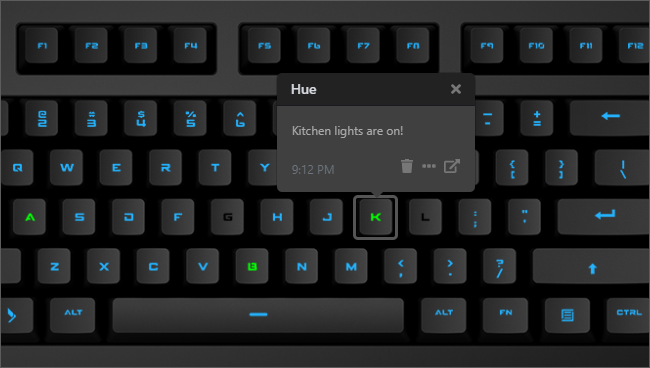

# Q Applet: Philips Hue

Displays whether hue lights are on or off in a room on a Das Keyboard Q Series.

[GitHub repository](https://github.com/DisabledMonkey/daskeyboard-applet--hue)

## Example

Lights are on in kitchen, basement, and attic; Lights are off in garage and living room

